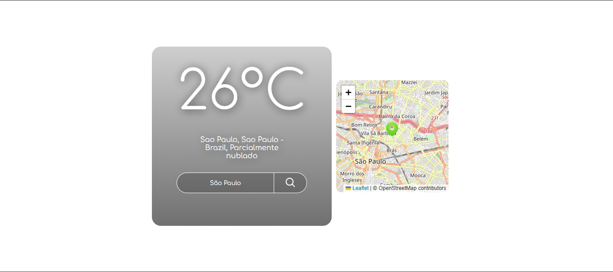
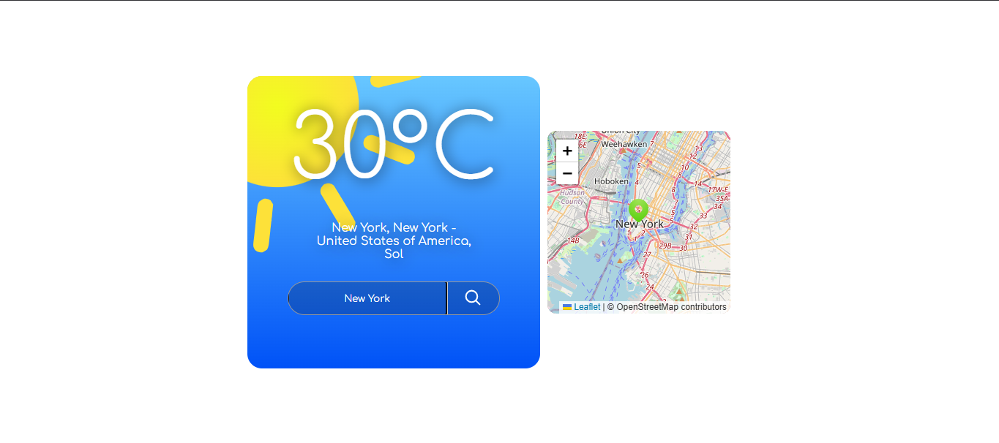

# ⛅ Weather Web App

> A simple and responsive web application that displays current weather conditions for any city entered by the user, with support for automatic geolocation.

---

## 📸 Preview

Live Demo: https://samuel-fsilva.github.io/weatherV2/




---

## 🚀 Features

- 🔍 Search weather by city name
- 📍 Automatic location detection (with user permission)
- 🌡️ Real-time temperature display
- ☁️ Weather condition description (e.g., cloudy, sunny)
- 🗺️ Interactive map showing the location (double click on the map, you'll see the magic happens 😎)

---

## 🛠️ Technologies

- HTML5
- CSS3
- JavaScript (Vanilla)
- Weather API ([WeatherAPI](https://www.weatherapi.com/))
- Map library ([Leaflet + OpenStreetMap](https://leafletjs.com/index.html))
- Geolocation API (Browser Native)

---

## 📦 Installation

```
# Clone the repository
git clone https://github.com/samuel-fsilva/weatherV2.git

# Enter the folder
cd weatherV2
```

---

## ▶️ Usage

- Download and unzip or clone the project
- Open the folder named weatherV2, then open index.html in your browser
- Enjoy!

---

## 📁 Project Structure

```
weatherV2/
│── css/
│   └── leaflet.css
│   └── styles.css
│── js/
│   └── app.js
│   └── dom.js
│   └── location.js
│   └── map.js
│   └── weatherapi.js
│── index.html
│── README.md
```

---

## 🗺️ Roadmap

- [ ] Move API key into a backend 
- [ ] Adjust site to work properly on mobile phones (CSS Queries)
- [ ] Make animations smoother and UI more responsive
- [ ] Add dark mode
- [ ] Add the weather forecast functionality

---

## 🙋‍♂️ Author

GitHub: https://github.com/samuel-fsilva
